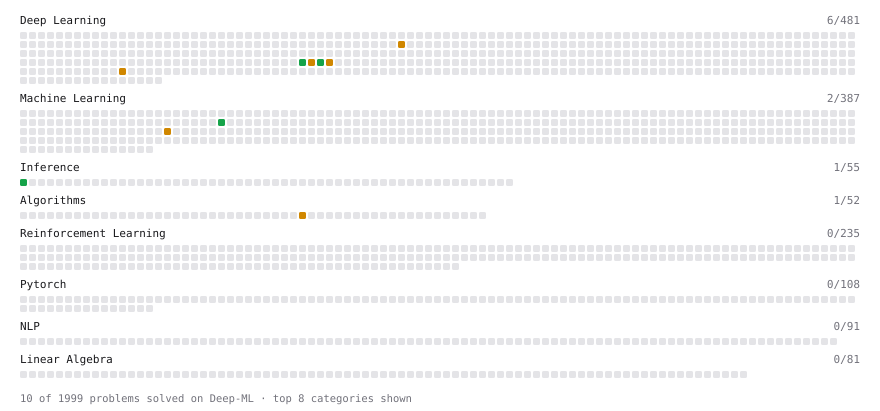

# Deep-ML

My machine learning practice from [Deep-ML](https://www.deep-ml.com). Every solution here was written by hand.

**14** solved · 8 problems · 0 labs · 6 math

[**Browse the interactive portfolio**](https://AATK1331.github.io/deep-ml/) to replay this filling in over time.

## Problems

| | Difficulty | Solved | |
| --- | --- | --- | --- |
| [Compute TTFT ITL and TPS from a Token Timestamp Stream](https://www.deep-ml.com/problems/411) | easy | 2026-11-09 | [solution](problems/0411-compute-ttft-itl-and-tps-from-a-token-timestamp-stream) |
| [Graph Representations: Edge Lists, CSR and the Normalized Adjacency](https://www.deep-ml.com/problems/1472) | easy | 2026-11-01 | [solution](problems/1472-graph-representations-edge-lists-csr-and-the-normalized-adjacency) |
| [Neighborhood Aggregation and the k-Hop Receptive Field](https://www.deep-ml.com/problems/1474) | easy | 2026-11-07 | [solution](problems/1474-neighborhood-aggregation-and-the-k-hop-receptive-field) |
| [Implement Graph Convolution Network (GCN) Layer](https://www.deep-ml.com/problems/453) | medium | 2026-11-09 | [solution](problems/0453-implement-graph-convolution-network-gcn-layer) |
| [Number of Islands (Grid Connected Components)](https://www.deep-ml.com/problems/1186) | medium | 2026-11-01 | [solution](problems/1186-number-of-islands-grid-connected-components) |
| [PageRank by Power Iteration](https://www.deep-ml.com/problems/1473) | medium | 2026-11-07 | [solution](problems/1473-pagerank-by-power-iteration) |
| [QK and OV Circuits from Head Weights](https://www.deep-ml.com/problems/1614) | medium | 2026-11-07 | [solution](problems/1614-qk-and-ov-circuits-from-head-weights) |
| [Spectral Clustering via Graph Laplacian](https://www.deep-ml.com/problems/824) | medium | 2026-11-08 | [solution](problems/0824-spectral-clustering-via-graph-laplacian) |

## Math

| | Difficulty | Solved | |
| --- | --- | --- | --- |
| [Adjacency, Degree and the Normalized Adjacency Matrix](https://www.deep-ml.com/math-problems/187) | easy | 2026-10-29 | [solution](math/0187-adjacency-degree-and-the-normalized-adjacency-matrix) |
| [Bytes in the KV Cache (MHA, GQA, MQA, MLA)](https://www.deep-ml.com/math-problems/62) | easy | 2026-11-07 | [solution](math/0062-bytes-in-the-kv-cache-mha-gqa-mqa-mla) |
| [Arithmetic Intensity of Matmul vs Decode Attention](https://www.deep-ml.com/math-problems/63) | medium | 2026-11-08 | [solution](math/0063-arithmetic-intensity-of-matmul-vs-decode-attention) |
| [Roofline: Time is the Max of Bytes/BW and FLOPs/Peak](https://www.deep-ml.com/math-problems/64) | medium | 2026-11-09 | [solution](math/0064-roofline-time-is-the-max-of-bytes-bw-and-flops-peak) |
| [The Graph Laplacian, Its Eigenvectors and Spectral Clustering](https://www.deep-ml.com/math-problems/189) | medium | 2026-10-31 | [solution](math/0189-the-graph-laplacian-its-eigenvectors-and-spectral-clustering) |
| [Eigendecomposition and SVD](https://www.deep-ml.com/math-problems/16) | hard | 2026-10-31 | [solution](math/0016-eigendecomposition-and-svd) |

---

_This file is regenerated by Deep-ML on every push._
